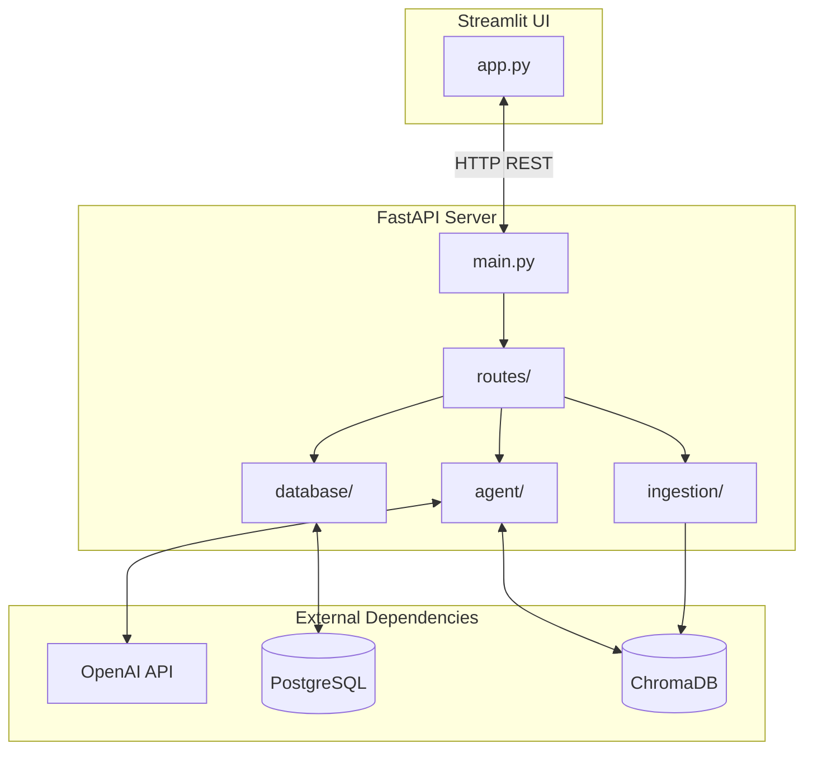
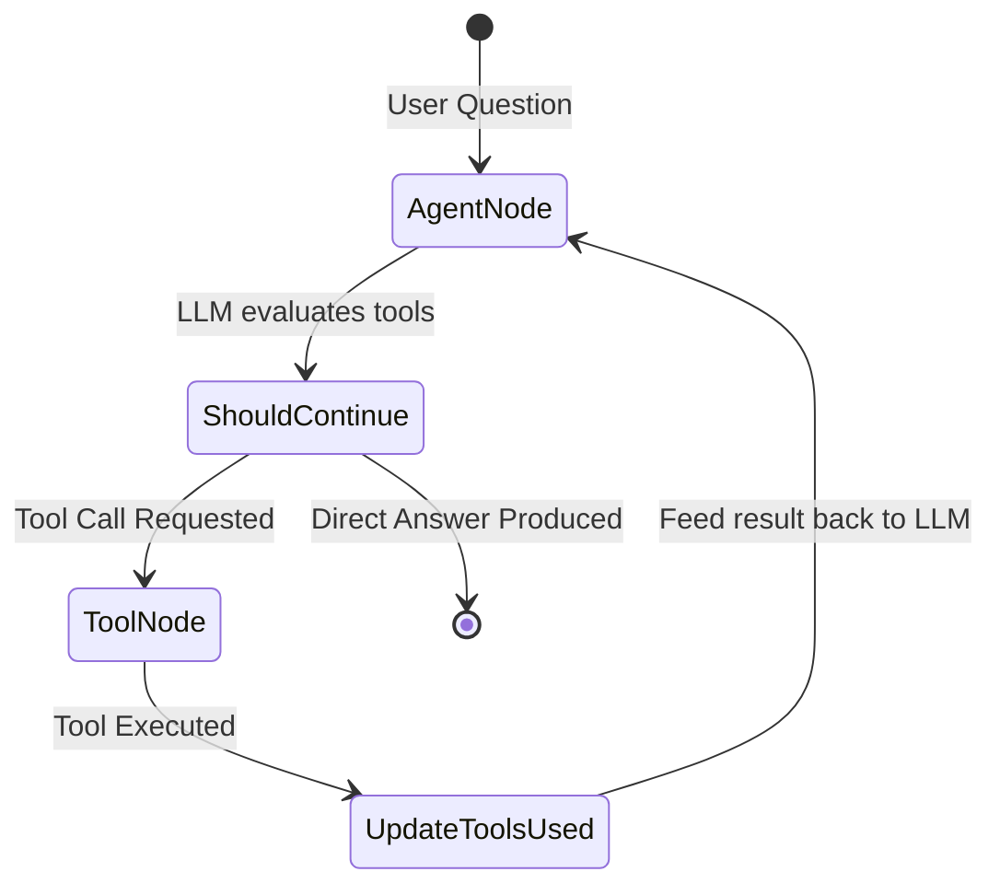

# 🏛️ Athena — Project Architecture & Understanding Guide

This document serves as a deep dive into the internal workings of **Athena**, an agentic Retrieval-Augmented Generation (RAG) system. While the `README.md` provides instructions on *how to run* the project, this guide explains *how it works* and *why it is built this way*.

---

## 1. High-Level Concept

Athena is an intelligent research assistant. Unlike traditional RAG systems that *always* query a vector database, Athena uses a **Routing Agent**. 

When a user asks a question, Athena's "brain" (the LLM) evaluates the query against the descriptions of its available tools. It then autonomously decides whether to:
1. Search your uploaded private documents.
2. Search the live web for current events.
3. Search arXiv for academic research papers.
4. Answer directly (if it's a casual greeting or a simple follow-up).

This makes Athena **"Agentic"** — it exhibits agency by making decisions and taking actions on your behalf, rather than following a rigid, linear script.

---

## 2. System Architecture

The project is structured as a modern, decoupled full-stack application.

### Key Components

*   **Frontend (Streamlit):** A pure presentation layer. It manages UI state, file uploads, and renders the chat history. It does not contain any AI logic.
*   **Backend (FastAPI):** The workhorse. It exposes REST endpoints (`/query`, `/upload`, `/conversations`), manages database sessions, and executes the agent graph.
*   **PostgreSQL:** Relational database storing conversation history, individual messages, and metadata about uploaded documents.
*   **ChromaDB:** A local Vector Database. It stores numerical representations (embeddings) of text chunks from your uploaded documents to enable fast semantic search.

---

## 3. The Agent Brain (LangGraph)

The core intelligence lives in `backend/agent/`. We use **LangGraph** to build the agent as a state machine.

Why LangGraph instead of a simple LangChain `AgentExecutor`? LangGraph gives us explicit control. We define nodes (steps) and edges (transitions). When debugging, we can see exactly which node executed and why.

### The Agent State Machine

1.  **`AgentState` (`state.py`):** The memory object that flows through the graph. It contains the list of chat `messages` and a `tools_used` list.
2.  **`agent_node` (`nodes.py`):** Calls the OpenAI LLM. Crucially, it binds our custom tools to the LLM. The LLM returns either a text response or a `tool_call`.
3.  **`should_continue` (`nodes.py`):** A routing function. If the LLM requested a tool, it routes the graph to the `tool_node`. If not, it routes to `END`.
4.  **`tool_node` (`nodes.py`):** Executes the Python function associated with the requested tool (e.g., executing the web search).
5.  **`update_tools_used` (`nodes.py`):** Updates the state to log which tool was used so the UI can display a badge. The graph then loops back to the `agent_node` so the LLM can interpret the tool's output.

---

## 4. The Tools

Tools are standard Python functions decorated with `@tool` from LangChain. The most critical part of a tool is its **docstring** — the LLM reads this docstring to understand when and how to use the tool.

*   **Document Search (`document_tool.py`):** Uses ChromaDB to perform a similarity search against uploaded documents.
*   **Web Search (`web_search.py`):** Uses DuckDuckGo (via `langchain-community`) to search the live internet.
*   **arXiv Search (`arxiv_tool.py`):** Uses the arXiv API to fetch summaries of academic papers.

---

## 5. Document Ingestion Pipeline

When you upload a PDF or text file, it doesn't go straight to the agent. It goes through the ingestion pipeline (`backend/ingestion/`).

1.  **Loader (`loader.py`):** Reads the raw bytes and converts them into LangChain `Document` objects containing text and metadata (like filename and page number).
2.  **Chunker (`chunker.py`):** LLMs have limited context windows, so we can't feed a whole book at once. The chunker splits the text into overlapping segments (default: 1000 characters with 200 character overlap).
3.  **Embedder (`embedder.py`):** Takes the text chunks, sends them to OpenAI's embedding model to convert them into high-dimensional vectors, and saves these vectors into ChromaDB.

---

## 6. The Data Layer (PostgreSQL)

We use SQLAlchemy for asynchronous database operations (`backend/database/`).

*   **Models (`models.py`):** 
    *   `Conversation`: Groups messages together.
    *   `Message`: Stores the role (user/assistant) and the text content.
    *   `Document`: Tracks what files have been uploaded and their ingestion status.
*   **CRUD (`crud.py`):** Helper functions to Create, Read, Update, and Delete records.
*   **Session (`session.py`):** Manages the async connection to Postgres.

---

## 7. Tracing a Request Flow

To understand the system, trace what happens when you type a question in the UI:

1.  **Frontend:** You type "What is the stock price of Apple?" in Streamlit (`app.py`).
2.  **API Call:** Streamlit sends a POST request to `http://localhost:8000/query` with the question and the current `conversation_id`.
3.  **Route (`query.py`):** 
    *   FastAPI looks up the conversation history in PostgreSQL.
    *   It appends your new question to the history.
    *   It invokes the LangGraph `compiled_graph`.
4.  **Agent Execution:**
    *   The `agent_node` passes the history to OpenAI.
    *   OpenAI realizes this requires current data and returns a `tool_call` for `web_search`.
    *   The graph routes to the `tool_node`.
    *   DuckDuckGo is queried for "Apple stock price".
    *   The graph loops back to the `agent_node`.
    *   OpenAI reads the DuckDuckGo results and formulates a final sentence: "Apple's current stock price is..."
5.  **Persistence:** The FastAPI route saves your question and the assistant's answer to PostgreSQL.
6.  **Response:** The route returns the answer and the tools used back to Streamlit.
7.  **Render:** Streamlit displays the message and a "🌐 Web Search" badge.

---

## 8. Testing & Evaluation

A production system requires robust testing (`tests/` and `evaluation/`).

*   **Unit Tests (`pytest`):** We use a mocked LLM (`tests/conftest.py`). This means when the tests run, they don't actually call OpenAI. This makes tests fast, free, and immune to network issues. We test that the API endpoints return 200 OK, the database saves records, and the ingestion pipeline chunks text correctly.
*   **Evaluation (`eval_agent.py`):** This is a specialized script. Unlike unit tests, this *does* call the real LLM. It runs 10 specific, tricky questions (defined in `test_cases.json`) and measures **Routing Accuracy** — did the LLM pick the right tool for the job? This proves the agent is actually "smart".
